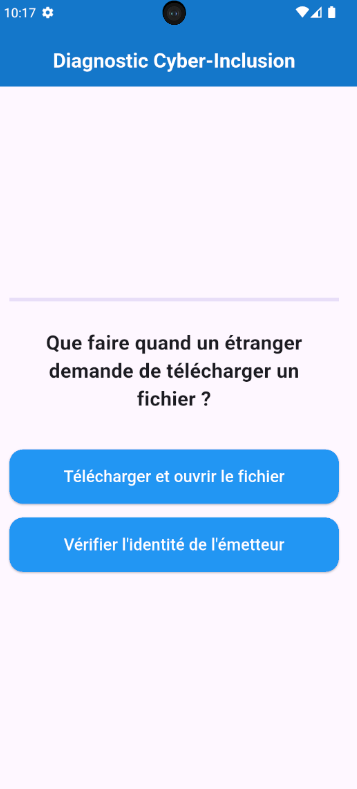
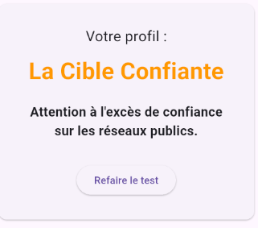

# 🛡️ CyberScore

> Application mobile réalisée pour le CMCS 2026 permettant de tester ses connaissances face aux menaces de cybersécurité.

---

## 📸 Aperçu
<p align="center">
  
  
  
  
</p>

---

## ✨ Fonctionnalités
- 📝 **QCM Interactif** : Test de connaissances sur la sécurité numérique.
- 📊 **Calcul de score** : Algorithme de diagnostic en fin de test.
- 🎯 **Profils utilisateurs** : Définition de 3 profils (Passager intimidé, Cible confiante, Éclaireur prudent).

---

## 🛠️ Stack Technique
- **Framework** : Flutter (Dart)
- **Design** : Material Design

---

## ⚙️ Installation & Lancement

```bash
# 1. Cloner le projet
git clone [https://github.com/Lauryne-aussurin/cyberscore](https://github.com/Lauryne-aussurin/cyberscore)

# 2. Accéder au dossier
cd cyberscore

# 3. Récupérer les dépendances
flutter pub get

# 4. Lancer l'application
flutter run
